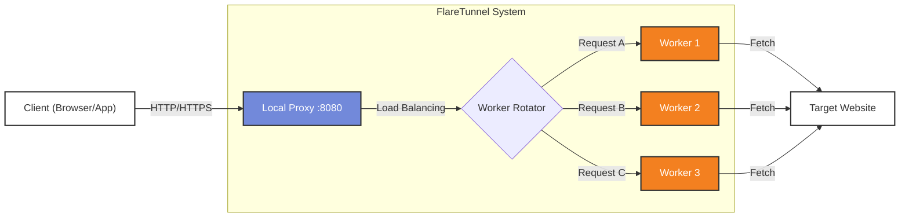

# 🚀 FlareTunnel

<div align="center">


**A unified proxy system that routes traffic through Cloudflare Workers for IP rotation and anonymity**

```
Client → FlareTunnel (local) → Cloudflare Workers → Target Website
```


</div>

**FlareTunnel** is a powerful, unified proxy system that leverages **Cloudflare Workers** to create a robust, rotating proxy network. It allows you to route your traffic through Cloudflare's global edge network, providing high anonymity, speed, and reliability.

## ✨ Features

*   **🌐 Unlimited Rotating Proxies**: Automatically deploy and manage multiple Cloudflare Workers as proxy endpoints.
*   **🔄 Smart Load Balancing**: Distributes traffic across your workers using Random or Round-Robin strategies.
*   **⚡ High Performance**: Uses Cloudflare's global edge network for low latency.
*   **🔐 SSL/HTTPS Support**: Full support for HTTPS traffic with optional SSL interception for deep inspection.
*   **👥 Multi-Account Support**: seamless management of multiple Cloudflare accounts to maximize request quotas (100k requests/day per account).
*   **🛡️ Ad & Tracker Blocking**: Built-in blacklist system to block unwanted traffic and save worker quotas.
*   **📊 Analytics**: Real-time usage statistics and quota tracking per account.

## 🏗️ Architecture



## 📦 Installation

### Build from Source
```bash
git clone https://github.com/johndoe237/FlareTunnel.git
cd FlareTunnel
go build -o FlareTunnel .
```

## 🚀 Usage

### Proxy authentication

The local proxy requires HTTP Basic authentication for every request, including
`GET`, `POST`, `PUT`, `PATCH`, `DELETE`, `HEAD`, `OPTIONS`, and `CONNECT`.
Set `AUTH_PROXY_BASIC` to the Base64 encoding of `username:password` before
starting the tunnel:

```bash
export AUTH_PROXY_BASIC="dXNlcjE6cGFzczE=" # Base64("user1:pass1")
./FlareTunnel tunnel
```

Clients must send `Proxy-Authorization: Basic <AUTH_PROXY_BASIC>`. Missing or
incorrect credentials receive `407 Proxy Authentication Required` with a
`Proxy-Authenticate: Basic` challenge. Authentication is checked before
forwarding or establishing a `CONNECT` tunnel.

### 1. Configuration
First, set up your Cloudflare credentials. You'll need your Account ID and an API Token (with "Edit Cloudflare Workers" permission).

```bash
./FlareTunnel config
```

### 2. Create Proxies
Deploy new workers to your Cloudflare account.

```bash
# Create 5 new proxy workers
./FlareTunnel create --count 5
```

### 3. Start the Tunnel
Start the local proxy server. By default, it runs on `localhost:8080`.

```bash
./FlareTunnel tunnel
```

Now configure your browser or application to use the proxy:
*   **Host**: `127.0.0.1`
*   **Port**: `8080`

## 🛠️ Commands Reference

| Command | Description |
|---------|-------------|
| `config` | Configure Cloudflare API credentials (supports multiple accounts) |
| `create` | Deploy new Worker proxies |
| `list` | List all active proxies and show usage stats |
| `tunnel` | Start the local proxy server |
| `test` | Test connectivity of your proxies |
| `cleanup` | Delete all workers from your account; use `--account <NAME> --count <N> --yes` for bounded cleanup or `--yes` for historical full cleanup |

## 🗑️ Cleanup

### Bounded cleanup

To delete at most a precise number of FlareTunnel Workers from one account, use:

```bash
./FlareTunnel cleanup --account main --count 20 --yes
```

`--count` selects only Workers that actually exist. If the account contains fewer than 20
FlareTunnel Workers, only the existing Workers are deleted. The bounded form requires both
`--account` and `--yes`, and never asks for interactive stdin input.

### Historical full cleanup

Without `--count`, the historical command continues to delete all FlareTunnel Workers from the
selected account:

```bash
./FlareTunnel cleanup --account main --yes
```

## 📖 Basic Usage

### Browser Configuration
```
HTTP Proxy:  127.0.0.1:8080
HTTPS Proxy: 127.0.0.1:8080
```

### Python
```python
import requests
import urllib3
urllib3.disable_warnings(urllib3.exceptions.InsecureRequestWarning)

proxies = {
    'http': 'http://127.0.0.1:8080',
    'https': 'http://127.0.0.1:8080'
}

r = requests.get("https://httpbin.org/ip", 
                 proxies=proxies, 
                 verify=False)

print(r.json()['origin'])  # Cloudflare Worker IP
```

### Quick Test
```bash
./FlareTunnel test
```

---

## 🎯 Common Commands

```bash
# Worker Management
./FlareTunnel list                    # List all workers
./FlareTunnel list --verbose          # Detailed view (created, age, live status)
./FlareTunnel list --status           # Check worker response times
./FlareTunnel test                    # Test workers
./FlareTunnel cleanup                 # Delete workers from ALL accounts
./FlareTunnel cleanup --account main  # Delete workers from 'main' only
./FlareTunnel cleanup --account main --yes              # Delete all workers without confirmation
./FlareTunnel cleanup --account main --count 20 --yes   # Delete at most 20 existing workers

# Multi-Account Worker Creation
./FlareTunnel create --count 10 --distribute    # Auto-distribute based on quota
./FlareTunnel create --count 5 --account main   # Create on specific account

# Configuration Backup & Restore
./FlareTunnel export                          # Export config (accounts + credentials)
./FlareTunnel import --input config.json      # Import config (replace)
./FlareTunnel import --input config.json --merge  # Merge with existing

# Tunnel (Proxy Server)
./FlareTunnel tunnel --verbose        # Basic
./FlareTunnel tunnel --workers 0-2    # Specific workers
./FlareTunnel tunnel --mode random    # Random rotation

# With Blacklist (Recommended!)
./FlareTunnel tunnel --verbose        # Default: blacklist-minimal.txt
./FlareTunnel tunnel --blacklist blacklist.txt --verbose

# With Burp Suite
./FlareTunnel tunnel --port 9090 --upstream-proxy http://127.0.0.1:8080 --verbose
```

---

## 💡 Blacklist System

### blacklist-minimal.txt (Default) ⚡
```
✅ Analytics (google-analytics, mixpanel)
✅ Images (.jpg, .png, .gif, etc.)
✅ Fonts (.woff, .ttf, etc.)
✅ Source maps (.map)

Saves: ~30-40% Worker requests
Website: Works perfectly in browser
```

### blacklist.txt (Full) 🔥
```
✅ Everything in minimal
✅ Advertising
✅ Social tracking
✅ CSS/JS files
✅ CDN libraries

Saves: ~60-70% Worker requests
Website: May look broken (missing assets)
```

### blacklist-aggressive.txt (Maximum) 💪
```
✅ Everything in full
✅ Almost everything except HTML/API

Saves: ~80-90% Worker requests
Website: Will break in browser (automation tools only)
```

---
## 🌟 Star History

[](https://www.star-history.com/#MorDavid/FlareTunnel&type=date&legend=top-left)

## ⚠️ Disclaimer

This tool is for educational and research purposes only. Please respect Cloudflare's Terms of Service. The authors are not responsible for any misuse of this tool.

**Made with ❤️ for the security and automation community**

## HTTPS CONNECT, MITM et streaming LLM

Lorsque l’interception SSL est activée, FlareTunnel utilise un **MITM TLS explicite**. Le client établit un `CONNECT` vers FlareTunnel, FlareTunnel présente au client un certificat de domaine signé par le CA FlareTunnel, déchiffre la requête HTTPS, puis envoie une requête HTTPS distincte vers le Worker Cloudflare. Le Worker récupère ensuite la cible à partir de l’URL de routage et transmet le body upstream.

Le client qui utilise FlareTunnel doit donc faire confiance au certificat public `Flaretunnel-MITM-CA.crt`. La clé privée du CA ne doit jamais être installée dans le client, dans `omni-boot` ou dans OmniRoute. Elle reste uniquement dans le déploiement de FlareTunnel-Manager.

Cette architecture permet à FlareTunnel de relayer les requêtes HTTPS d’OmniRoute sans modifier les URLs provider ni demander à OmniRoute d’envoyer des requêtes HTTP non chiffrées au proxy. Elle implique une conséquence de sécurité importante : toute personne qui obtient la clé privée du CA peut forger un certificat pour n’importe quel domaine intercepté par FlareTunnel. La protection repose donc sur le gestionnaire de secrets du déploiement, l’absence de logs de la clé, les permissions runtime `0600`, l’authentification du proxy et la rotation manuelle du couple CA public/privé en cas de suspicion de fuite.

Les certificats de domaine générés par FlareTunnel sont valides pendant un an. La rotation du CA racine doit être planifiée comme une opération coordonnée : générer un nouveau CA, déployer le nouveau certificat public dans `omni-boot`, injecter la nouvelle clé dans le manager, puis redémarrer les deux services. Le code ne publie pas la clé privée et ne journalise pas son contenu.

Le chemin `CONNECT` utilise un délai limité pour la connexion et les headers upstream, mais aucun délai global pour le body. Les événements SSE sont lus par blocs disponibles et chaque bloc est immédiatement écrit sur la connexion TLS hijackée. Comme cette connexion est un `net.Conn` et non un `http.ResponseWriter`, aucun appel `Flush()` séparé n’est nécessaire : il n’existe pas de buffer HTTP intermédiaire à vider. Le test d’intégration CONNECT vérifie vingt événements SSE espacés d’environ 200 millisecondes sur une durée d’environ quatre secondes.
